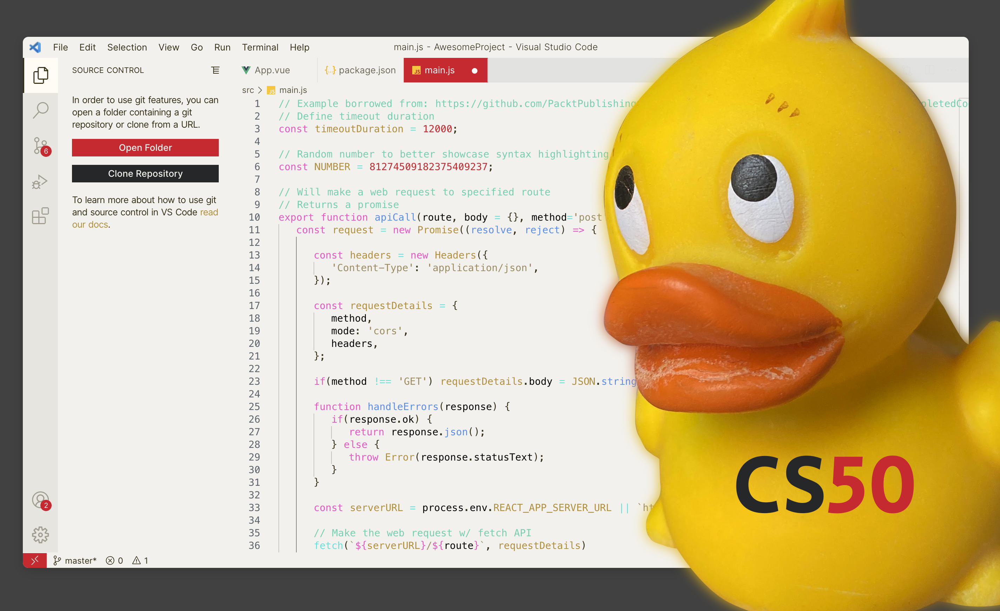

# PressConference EA

<p align="center">
  
  &nbsp;&nbsp;&nbsp;&nbsp;&nbsp;&nbsp;
  
</p>

<h3 align="center">CS50's Introduction to Computer Science</h3>
<h4 align="center">Harvard University - Final Project</h4>

---

PressConference EA is a web application focused on engagement and sports storytelling for **EA FC 26** players. The system transforms the stats from a post-match screenshot and a brief player comment into an interactive, immersive 3-round press conference, where the AI acts as the reporter and the user as the coach. At the end, the app generates a stylized sports article covering the conference.

## Project Structure

* `docs of project/`: Contains project specification files and task definitions.
* `requirements.txt`: List of Python dependencies for the project.

## Installation & Setup

Follow these steps to set up and run the project locally.

### 1. Prerequisites

Make sure you have Python 3.10+ installed on your machine. You can check your version by running:
```bash
python --version
```

### 2. Create a Virtual Environment

It is highly recommended to use a virtual environment to isolate the project dependencies. Create one by running:
```bash
python -m venv venv
```

### 3. Activate the Virtual Environment

Activate the virtual environment depending on your operating system and shell:

* **Windows PowerShell:**
  ```powershell
  .\venv\Scripts\Activate.ps1
  ```
* **Windows CMD:**
  ```cmd
  .\venv\Scripts\activate.bat
  ```
* **Linux / macOS:**
  ```bash
  source venv/bin/activate
  ```

Once activated, you will see `(venv)` at the beginning of your terminal prompt.

### 4. Install Dependencies

Install all required Python packages defined in `requirements.txt`:
```bash
pip install -r requirements.txt
```

This will install the following main packages:
* **Flask:** Backend web framework.
* **google-generativeai:** SDK to interact with Gemini API.
* **python-dotenv:** To manage environment variables.
* **werkzeug:** Helper library for password hashing.

### 5. Configure Environment Variables

The application requires environment variables for security keys and API integrations:

1. Copy the template file to create your local `.env` file:
   ```bash
   cp .env.example .env
   ```
   *(On Windows PowerShell, you can use `copy .env.example .env`)*

2. Open the newly created `.env` file and fill in your keys:
   * **`FLASK_SECRET_KEY`**: A secure random key for signing cookies (sessions).
   * **`GEMINI_API_KEY`**: Your Google Gemini API Key from Google AI Studio.

### 6. Initialize the Database

Before running the application for the first time, you must create and initialize the database file and its tables. Execute the following command in your terminal from the project root:
```bash
python -m services.db
```
This will automatically generate the `conference_data.db` SQLite file and execute [schema.sql](schema.sql) to create all required tables and indexes. If you ever need to reset your database to a clean slate, you can simply delete the `conference_data.db` file and run this command again.

### 7. Run the Application

Once the database is initialized, start the Flask development server:
```bash
python -m flask run
```
By default, the server runs on `http://127.0.0.1:5000/`. Open this URL in your web browser to access the application.

---

## 💡 Quick Evaluation Tip (Mock Mode)

To make evaluation simple and avoid requiring a live Google Gemini API key:
1. Open your `.env` file (copied from `.env.example`).
2. Set `MOCK_GEMINI=true`.
3. Run the application normally. With this flag set, the application will run in **Mock Mode**, providing pre-configured questions and sports articles instantaneously without making any external network requests or requiring a valid `GEMINI_API_KEY`.

---

## Database Usage & Helpers

To simplify database operations and avoid repeating connection boilerplate, you can use the database service located in [services/db.py](services/db.py).

### Importing the Service

Import the helpers into your routes or scripts:
```python
from services.db import query_db, execute_db, get_db
```

### 1. Fetching Data (`query_db`)

Use `query_db` to run `SELECT` queries. 

* **To fetch multiple records:**
  ```python
  users = query_db("SELECT * FROM users")
  for user in users:
      print(user["username"]) # Access columns by name thanks to sqlite3.Row
  ```

* **To fetch a single record:**
  Set `one=True` to return only the first row (or `None` if no record is found):
  ```python
  user = query_db("SELECT * FROM users WHERE id = ?", (user_id,), one=True)
  if user:
      print(user["username"])
  ```

### 2. Modifying Data (`execute_db`)

Use `execute_db` to run `INSERT`, `UPDATE`, or `DELETE` queries. It automatically commits changes to the database.

* **Inserting a record:**
  ```python
  execute_db("INSERT INTO users (username, hash) VALUES (?, ?)", (username, hashed_password))
  ```

* **Updating a record:**
  ```python
  execute_db("UPDATE conferences SET headline = ? WHERE id = ?", (new_headline, conf_id))
  ```

### 3. Direct Connection Control (`get_db`)

If you need full control over the database connection (e.g. managing transactions manually), use the connection context manager:
```python
with get_db() as conn:
    # Run operations directly on the connection 'conn'
    cursor = conn.cursor()
    cursor.execute("...")
    # Connection is automatically closed at the end of the block
```

## Running Tests

We have automated tests to ensure everything in the project is working correctly. This includes:
* **Backend Tests:** Checks for core logic, database queries, security, authentication, and secure file upload functions.
* **UI (User Interface) Tests:** Browser-driven tests using **Playwright** that simulate actual clicks, typing, file selections, and drag-and-drop actions on the website screens.

### ⚠️ Clean and Isolated Testing (Temporary Databases)
To keep your main development/production data safe, we run tests on isolated, temporary databases:
* **Backend tests** use `test_conference_data.db`.
* **UI tests** use `test_ui_conference_data.db`.

These files are created automatically when the tests start, populated with clean tables, and **fully deleted** when the tests finish. This prevents testing data from mixing with your active databases and leaves no residues or clutter on your computer!

### How to Run the Tests

Make sure your virtual environment is active before running these commands.

1. **Install Browser Binaries (Required for UI tests):**
   Before running the UI tests for the first time, you must download the Chromium browser used by Playwright:
   ```bash
   playwright install chromium
   ```

2. **Run All Tests:**
   To run all backend and UI tests at once:
   ```bash
   pytest tests/
   ```

3. **Run Backend Tests Only:**
   To run only the backend logic, security, and upload utility tests:
   ```bash
   pytest tests/test_auth.py tests/test_security.py tests/test_upload.py
   ```

4. **Run UI Tests Only:**
   To run only the browser/UI tests:
   ```bash
   pytest tests/test_ui.py
   ```

